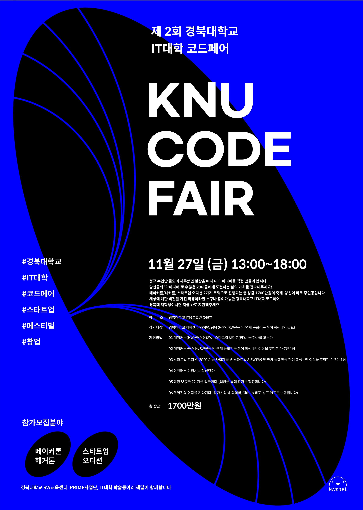

# 2020 SW중심대학 전자공학부 연계전공 학생참여 평가

## 2015117360 전자공학부 최강민
* 외부참여형
* 경진대회형
* 자율과제형

## 외부과제형
1. 대구광역시 중구 2030 청년창업지원사업(사업화 지원금 2000만원)

2. 대구SW마이스터고 고등학교 SW전공역량강화 프로그램 진행(3500만원 상당 평생교육 용역)

3. 경상북도 상주교육지원청 발명교육센터 창의융합교실 지원사업(7000만원 상당 의무교육 용역)

## 경진대회형
1. 대구광역시 공공데이터 활용창업경진대회 입상
(부동산 공시지가 예측 서비스 `내일의 집`)  

2. 제 2회 수성청년 바라는대로 포럼 "글로벌 썸머스쿨" 장려상
(`수성알파지식산업센터` 건립)

3. 대한민국 교육부 창업유망 U-300팀 창업도전형 인증[최종 선정]
(경북대학교 IT대학 학술동아리 `해달` + `(주)해달프로그래밍`)

## 자율과제형
1. 대구광역시 수성구 청년행복위원회 일자리분과 위원장
(수성구 청년행복센터 건립 추진)

2. 대구광역시 청년정책네트워크 일자리분과 분과위원장
(대구광역시 청년자율예산기금 정책 추진)

3. 대구광역시 중구 청년정책심의회 위원

4. 제 2회 KNU 코드페어 총괄
(총상금 1700만원 상당)  

5. 경북대학교 산학협력단 제 1기 K-청년창업멘토단

